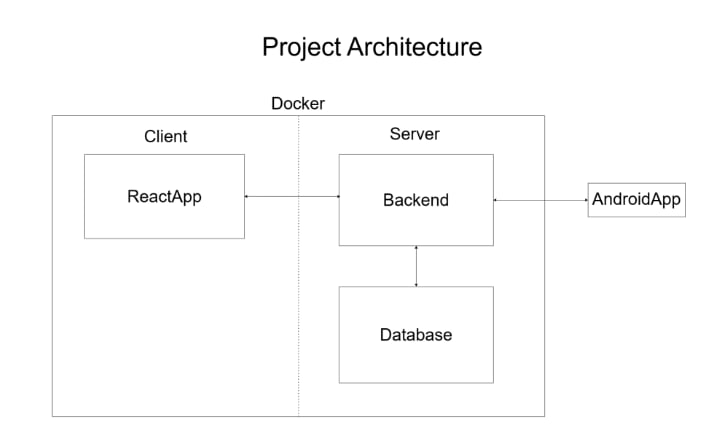

# 🛍️ Shopping List Application

 

Многофункциональное приложение для управления покупками с:
- **REST API сервером** (FastAPI + PostgreSQL)
- **Android клиентом** (Kotlin + Jetpack Compose)
- **Веб-интерфейсом** (React + TypeScript)

## 🚀 Быстрый старт

# 1. Клонируйте репозиторий

```bash
git clone https://github.com/SergeevaAlexandra/Shopping-list.git
cd shopping-list-app
```

# 2. Запустите backend
```bash
cd backend
pip install -r requirements.txt
python app/database_setup.py
```

```bash
uvicorn app.main:app --reload
```

# 3. Запустите Android приложение через Android Studio

- Откройте файл: app/src/main/java/com/example/shoppingapp/data/remote/ApiService.kt
- Убедитесь, что BASE_URL соответствует вашему серверу:

```bash
// Для эмулятора:
const val BASE_URL = "http://10.0.2.2:8000/"

// Для физического устройства (замените <LOCAL_IP> на IP вашего ПК):
const val BASE_URL = "http://<LOCAL_IP>:8000/"
```

- Соберите проект и запустите приложение с помощью Run 'app'